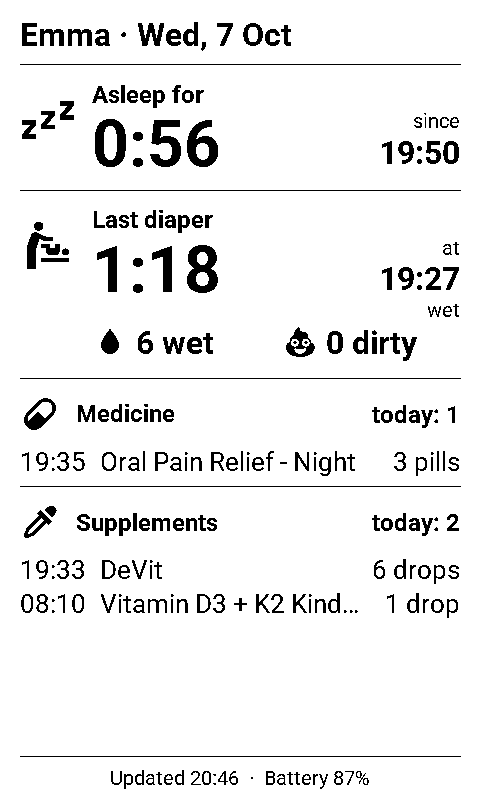
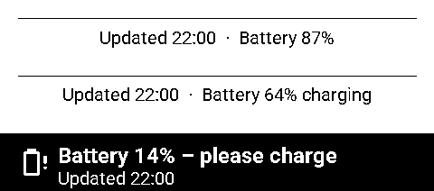

# Xteink X4 ESPHome — Sprout Track dashboard

[](https://github.com/Boisti13/xteink-x4-esphome/releases/latest)
[](https://esphome.io/)
[](packages/xteink_x4.yaml)
[](LICENSE)

Turn the **Xteink X4**, a pocket e-reader (ESP32-C3, 4.26" 800×480
e-paper), into a baby dashboard for the nursery or the fridge door. It shows
what [Sprout Track](https://github.com/Oak-and-Sprout/sprout-track) knows at
a glance: how long the baby has been awake (or asleep), when the last diaper
was changed, how many were wet or dirty today, and which medicine and
supplements were given when. [Home Assistant](https://www.home-assistant.io/)
fetches the data; the X4 runs [ESPHome](https://esphome.io/), wakes once an
hour during the day, draws the page and sleeps again — about a week on one charge.

<p align="center"></p>

## Highlights

- **Awake for / asleep for** with the time it started — at a glance whether a nap is due
- **Last diaper**: how long ago, at what time, wet or dirty; **wet and dirty today** (a "wet + dirty" one counts for both)
- **Medicine and supplements today**: every dose with time, name and amount, and how many — so nobody gives a second dose by mistake
- **Battery-friendly**: wakes on the full hour, draws once, deep sleep in between; **no wakes at night** (23:00–6:00, adjustable); the **power button** wakes it for a fresh page at any time
- **One Home Assistant package** (`packages/xteink_x4.yaml`): the Sprout Track API calls and every display value; nothing to click together in the UI
- **Battery in the footer** with *charging* while USB is plugged in; at 15 % or less the footer turns into a black **please charge** bar (adjustable with `battery_warning`)
- **Keep awake** switch in Home Assistant for OTA updates; the picture stays as it is when Home Assistant can't be reached
- E-paper keeps the last page without power; half refresh, so no ghosting

## How it works

```
Sprout Track API                 Home Assistant                       Xteink X4 (ESPHome)
/status          ──every 60 s──▶  packages/xteink_x4.yaml              wakes every full hour
/activities?type=medicine         sensor.xteink_x4_sleep      ──API──▶  (not 23–6) or on the button,
/activities?type=supplement       sensor.xteink_x4_diaper               draws the page once,
                                  sensor.xteink_x4_medicine             sleeps again
                                  sensor.xteink_x4_supplements
```

Home Assistant does all the work — it polls Sprout Track, picks out today's
entries, formats times and durations — so the device only prints ready-made
text. A wake takes about 10 seconds.

The last wake of the day is at 22:00, the first at 6:00. Change the quiet
hours with `quiet_start` and `quiet_end` at the top of
`esphome/xteink-x4.yaml` (same value twice = every hour, day and night).

The footer shows when the page was drawn, the battery level and whether
it's charging. When the battery is low and USB isn't plugged in, it turns
into a black bar:

<p align="center"></p>

Because the page is drawn once an hour, *awake for 0:56* is as of the time in
the footer (*Updated 20:46*). Press the power button for a fresh one.

## Install

You need Home Assistant with the **ESPHome Device Builder** app (add-on),
a running [Sprout Track](https://github.com/Oak-and-Sprout/sprout-track) with an
API key (*Settings → API*), an Xteink X4 and a USB-C cable.

**1. Secrets.** Add to Home Assistant's `/config/secrets.yaml` (your Sprout
Track address, baby ID and API key):

```yaml
sprout_track_auth: "Bearer st_live_…"
sprout_track_status_url: "http://192.168.1.50:3000/api/hooks/v1/babies/<baby-id>/status"
sprout_track_medicine_url: "http://192.168.1.50:3000/api/hooks/v1/babies/<baby-id>/activities?type=medicine&limit=20"
sprout_track_supplement_url: "http://192.168.1.50:3000/api/hooks/v1/babies/<baby-id>/activities?type=supplement&limit=20"
```

**2. Home Assistant package.** Turn on packages once in `configuration.yaml`,
if you haven't already:

```yaml
homeassistant:
  packages: !include_dir_named packages
```

Copy [`packages/xteink_x4.yaml`](packages/xteink_x4.yaml) to
`/config/packages/`, then run *Developer tools → YAML → Check configuration*
and reload *All YAML configuration*. `sensor.xteink_x4_sleep` should now show
something like `0:56`.

**3. ESPHome config.** Copy everything in [`esphome/`](esphome) into
`/config/esphome/`:

| File | What it is |
|---|---|
| `xteink-x4.yaml` | the device config: wake cycle, deep sleep, Wi-Fi, API |
| `xteink_x4_partitions.csv` | flash layout for the X4's 16 MB |
| `xteink_x4_modules/` | page layout, fonts, icons, sensors, buttons, power latch |
| `secrets.example.yaml` | copy its keys into your ESPHome `secrets.yaml` and fill them in — including a fixed IP address for the X4, which you also reserve on your router (it saves DHCP on every wake) |

**4. First flash over USB.** Back up the stock firmware first if you want to go
back later (see [Going back](#going-back-to-the-reader-firmware)). In the
ESPHome Device Builder: *xteink-x4 → Install → Plug into this computer*, or
build *Manual download* and flash it with [ESPHome Web](https://web.esphome.io/).

**5. Adopt in Home Assistant.** The device appears under *Settings → Devices
& services* as *Xteink X4*. Allow it to **perform Home Assistant actions**
in its ESPHome options.

**Later updates over Wi-Fi:** turn on **Xteink X4 Keep awake** (a helper, also on the X4's device page), press the power
button (or wait for the full hour), install, then turn *Keep awake* off again —
the device goes back to sleep at once.

## Home Assistant entities

**From the package**:

| Entity | State | Attributes |
|---|---|---|
| `sensor.xteink_x4_header` | *Emma · Wed, 7 Oct* | |
| `sensor.xteink_x4_sleep` | awake/asleep for, `H:MM` | `label` (*Awake for* / *Asleep for*), `since` (`HH:MM`) |
| `sensor.xteink_x4_diaper` | since the last diaper, `H:MM` | `time`, `type` (*wet*, *dirty*, *wet + dirty*), `wet`, `dirty` (today) |
| `sensor.xteink_x4_medicine` | doses today | `lines`: one per dose, newest first, `HH:MM\|name\|amount` |
| `sensor.xteink_x4_supplements` | doses today | `lines`, as above |
| `input_boolean.xteink_x4_keep_awake` | on = don't sleep | |
| `sensor.xteink_x4_sprout_status`, `_sprout_medicine`, `_sprout_supplements` | the raw API answers | |

"Today" is since midnight in Home Assistant's time zone.

**From the device**: `sensor.xteink_x4_battery` (%), `sensor.xteink_x4_battery_voltage` (V), `sensor.xteink_x4_wi_fi_signal`,
`sensor.xteink_x4_wake_connected_after` and `sensor.xteink_x4_wake_total` (seconds per wake),
`binary_sensor.xteink_x4_usb_power` (on while USB is plugged in),
and the seven buttons as `binary_sensor.xteink_x4_button_1` … `_button_4`,
`_button_up`, `_button_down`, `_power_button` (only while it's awake).

## Battery

The X4 still draws about 4 mA in deep sleep (the board leaks; see
[jumpit.eu](https://jumpit.eu/en/practice/xteink-x4-home-assistant-display/)),
so on its 650 mAh battery:

| Wakes | Lasts about |
|---|---|
| every hour, 6:00–22:00 (this config) | a week |
| every 10 minutes | 4 days |
| every minute | 1 day |

## Hardware

| | |
|---|---|
| SoC | ESP32-C3, 400 KB SRAM, no PSRAM, 16 MB flash |
| Display | 4.26" 800×480 GDEQ0426T82, SSD1677 — SPI: SCLK 8, MOSI 10, CS 21, DC 4, RST 5, BUSY 6 |
| Buttons | power GPIO3 (active low, also the wake pin); front buttons on a resistor ladder at GPIO1, side buttons at GPIO2 |
| Battery | 650 mAh LiPo, voltage on GPIO0 through a 1:2 divider; GPIO20 is high while USB is plugged in |
| Power latch | GPIO13 — held through deep sleep, otherwise the X4 switches itself off |
| Other | microSD on the same SPI bus (CS 12, MISO 7) |

The display and button drivers come from
[ngxson/esphome-component-xteink](https://github.com/ngxson/esphome-component-xteink),
loaded by ESPHome at build time and pinned to a fixed commit. Pin details
from Adafruit's [CircuitPython on the Xteink X4](https://learn.adafruit.com/circuitpython-on-the-xteink-x4-ereader/pinouts).

## Going back to the reader firmware

ESPHome replaces the stock (or [CrossPoint](https://github.com/crosspoint-reader))
firmware. To keep a way back, read the whole flash before the first ESPHome
flash:

```bash
esptool.py --chip esp32c3 --baud 921600 read_flash 0 0x1000000 xteink-x4-stock.bin
```

and write it back later with `esptool.py --chip esp32c3 write_flash 0 xteink-x4-stock.bin`.

## Repository layout

```
esphome/
  xteink-x4.yaml              # device config, wake cycle, deep sleep
  xteink_x4_partitions.csv    # 16 MB flash layout
  secrets.example.yaml
  xteink_x4_modules/
    display.yaml              # the page (lambda)
    fonts.yaml / images.yaml  # Roboto, Material Design Icons
    sensors.yaml              # battery voltage and level, Wi-Fi, wake times
    text_sensors.yaml         # values from Home Assistant
    binary_sensors.yaml       # seven buttons, keep awake
    switches.yaml             # Keep awake on the device page
    power.h                   # power latch, time to the next wake
packages/
  xteink_x4.yaml              # everything on the Home Assistant side
docs/
  preview.png / footer-states.png
```

## Development

`main` holds released versions, `dev` is where work happens. Changes go to
`dev`, get tested on a real X4, and are merged to `main` with a release
(`vX.Y.Z` tag, notes from [CHANGELOG.md](CHANGELOG.md)). Validate a config
without a device:

```bash
esphome config esphome/xteink-x4.yaml
```

## License

[MIT](LICENSE). The ESPHome components it loads are a separate project with
their own terms.
